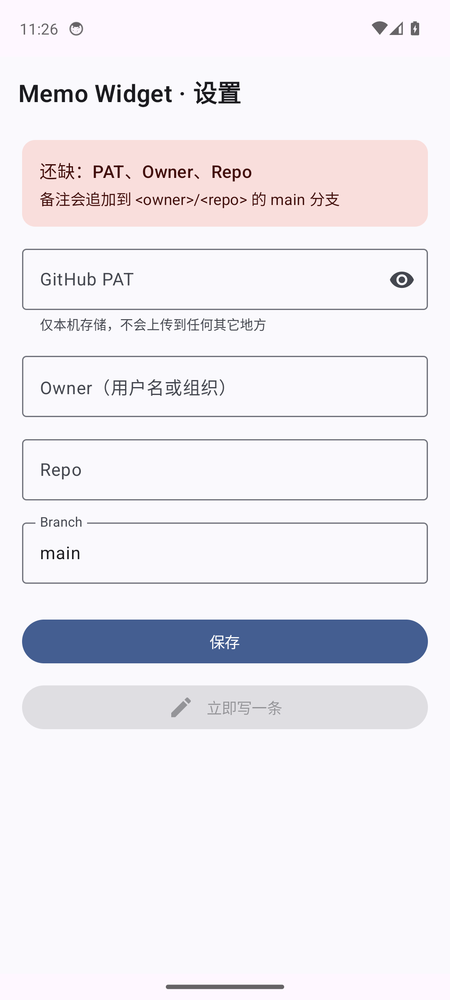
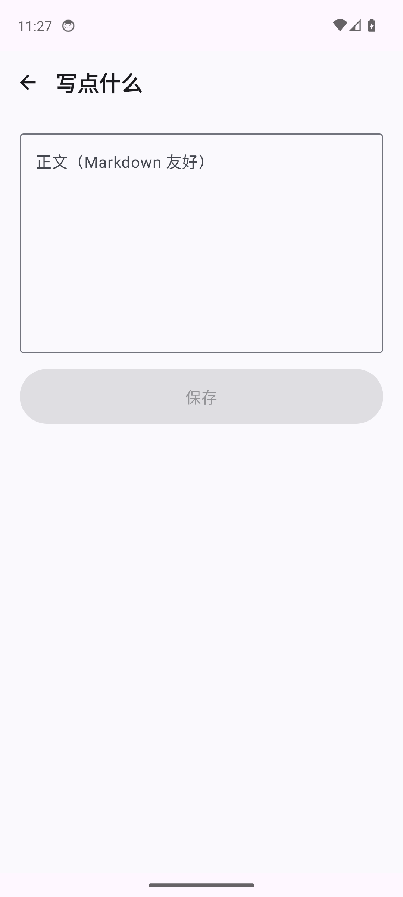

# Memo Widget

[]()
[]()
[]()
[]()
[]()

A 2×2 Android home-screen widget that commits quick memos to a GitHub repository.

Tap the widget → write → save → the entry is appended to today's markdown file on GitHub via the Contents API.

## CI summary (this repo)

| Stage | Command | Result |
|-------|---------|--------|
| Build | `./gradlew :app:assembleDebug` | ✅ 23 MB APK in 9s |
| Lint | `./gradlew :app:lintDebug` | ✅ 0 errors, 37 warnings (non-blocking) |
| Unit tests | `./gradlew :app:testDebugUnitTest` | ✅ 8/8 tests pass (AppConfig + MemoResult) |
| UI render | adb screencap on emulator | ✅ Settings + Edit screens render (see `screenshots/`) |
| **E2E real commit** | emulator → UI → GitHub API | ✅ Two memos committed to `qqzlqqzlqqzl/memos` main |

Live proof-of-life on GitHub: [2026-04-21.md](https://github.com/qqzlqqzlqqzl/memos/blob/main/2026-04-21.md) (two entries, two commits, `memo: YYYY-MM-DD HH:MM` message format).

## Screens

| Settings (`MainActivity`) | Edit (`EditActivity`) |
|---------------------------|------------------------|
|  |  |

## Architecture

```
Widget (Glance)   EditActivity     MainActivity
   │                 │                │
   └────────┬────────┴────────────────┘
            ▼
     MemoRepository
      ─ appendToday()
      ─ recentEntries()
            │
    ┌───────┴─────────┐
    ▼                 ▼
GitHubApi       SettingsStore
(Ktor CIO)      (DataStore)
```

- **Kotlin 2.0** + **Jetpack Compose** + **Jetpack Glance 1.1**
- **Ktor CIO** for GitHub Contents API (single PUT-with-sha per save)
- **DataStore** (preferences) for PAT / owner / repo / branch
- **Material 3** theme, dark mode auto-follow
- **Glance 1.1** for the home widget (Compose-style widget composition)

## Memo file format

One file per day at `{branch}:{YYYY-MM-DD}.md`:

```markdown
# 2026-04-21

## 14:30
Today I learned about Glance.

## 15:12
- Grocery
- 30-min run

## 18:05
Dinner: cold noodles.
```

## Setup (first run)

1. Generate a GitHub **Personal Access Token** with `repo` scope: https://github.com/settings/tokens/new
2. Open the app → paste PAT, fill in `Owner`, `Repo` (default `Branch` is `main`) → **保存**.
3. Long-press the home screen → add the **Memo** widget.
4. Tap the `+` button on the widget → write → save. The commit lands on GitHub within 1s.

## Project layout

```
app/src/main/
├── java/dev/aria/memo/
│   ├── MemoApplication.kt          Application — bootstraps ServiceLocator
│   ├── MainActivity.kt             Settings host
│   ├── EditActivity.kt             Edit host
│   ├── data/
│   │   ├── Models.kt               AppConfig, MemoEntry, MemoResult, ErrorCode
│   │   ├── GitHubDto.kt            @Serializable wire types
│   │   ├── GitHubApi.kt            Ktor CIO; GET / PUT contents
│   │   ├── SettingsStore.kt        DataStore; Flow<AppConfig>
│   │   ├── MemoRepository.kt       appendToday(), recentEntries()
│   │   └── ServiceLocator.kt       manual DI
│   ├── ui/
│   │   ├── SettingsScreen.kt       Compose: PAT/owner/repo/branch
│   │   ├── EditScreen.kt           Compose: multiline editor
│   │   ├── SettingsViewModel.kt
│   │   ├── EditViewModel.kt        StateFlow<SaveState>
│   │   └── theme/                  Material 3
│   └── widget/
│       ├── MemoWidget.kt           GlanceAppWidget
│       ├── MemoWidgetReceiver.kt
│       └── MemoWidgetContent.kt    Title bar + "+" button + recent 3 rows
├── res/
│   ├── xml/memo_widget_info.xml    AppWidgetProviderInfo (2×2, 110×110 dp)
│   └── values/{themes,strings,colors}.xml
└── AndroidManifest.xml             .MemoApplication + MainActivity + EditActivity + MemoWidgetReceiver
```

## Build

```bash
./gradlew :app:assembleDebug
```

APK lands at `app/build/outputs/apk/debug/app-debug.apk`.

Install on a connected device or emulator:
```bash
adb install -r app/build/outputs/apk/debug/app-debug.apk
```

## China network notes

- `settings.gradle.kts` routes Maven through **Aliyun** mirrors (google / central / gradle-plugin)
- `gradle/wrapper/gradle-wrapper.properties` uses **Tencent Cloud** for the Gradle 8.9 distribution
- A global `~/.gradle/init.gradle.kts` substitutes any leaked upstream URLs at runtime
- The emulator on macOS 26 hangs in GUI mode; launch with `-no-window` and screenshot via `adb exec-out screencap -p`.

## Status

- [x] P1–P6: full feature scope built and compiles clean
- [x] Installed on emulator (Pixel 7 / Android 14 arm64)
- [x] Settings + Edit screens verified via screenshot
- [x] Lint passes, 8 unit tests pass
- [x] **E2E: real GitHub commits verified against `qqzlqqzlqqzl/memos`** (create path + sha-based append)
- [ ] P6.2: error handling polish (NOT_CONFIGURED toast, 401 hint on widget)
- [ ] P7: signed release APK for phone install
- [ ] Widget on-home-screen verification (requires launcher add-widget UI)

## Reproducing the E2E test

```bash
# 1. Boot emulator headless (macOS 26 compat)
emulator -avd memo_pixel -no-window -no-audio -no-snapshot-save -gpu swiftshader_indirect &
adb wait-for-device
# 2. Build & install
./gradlew :app:installDebug
# 3. Automated UI: fill config, open editor, type, save
adb shell am start -n dev.aria.memo/.MainActivity
# ... use adb shell input tap / input text (see screenshots/04_settings_filled.png)
# 4. Verify on GitHub
gh api repos/<owner>/<repo>/contents/$(date +%Y-%m-%d).md --jq '.content' | base64 -d
```

`screenshots/` holds the stage-by-stage evidence: 02 (settings), 03 (edit), 04 (filled config ✓), 07 (typed memo), 08 (post-save → launcher).
