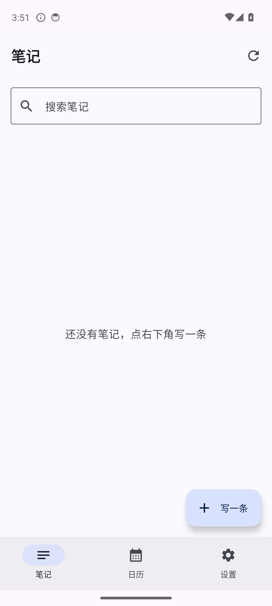
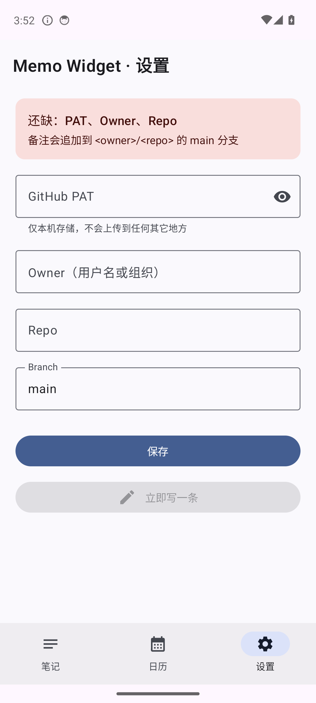
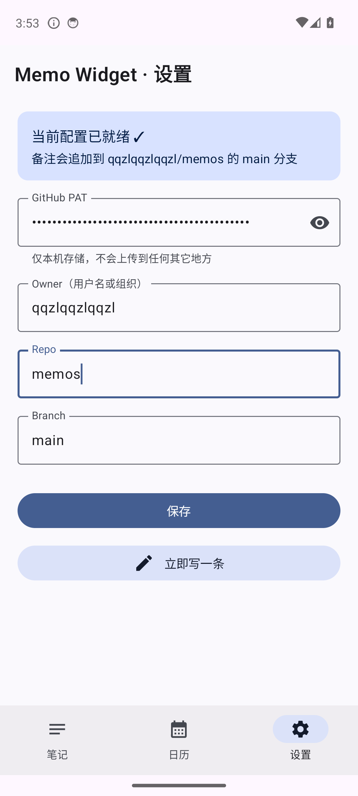
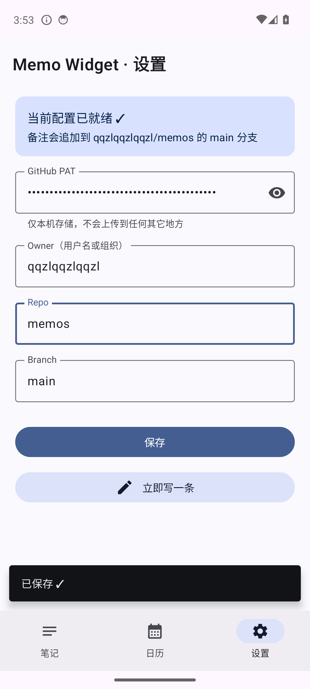
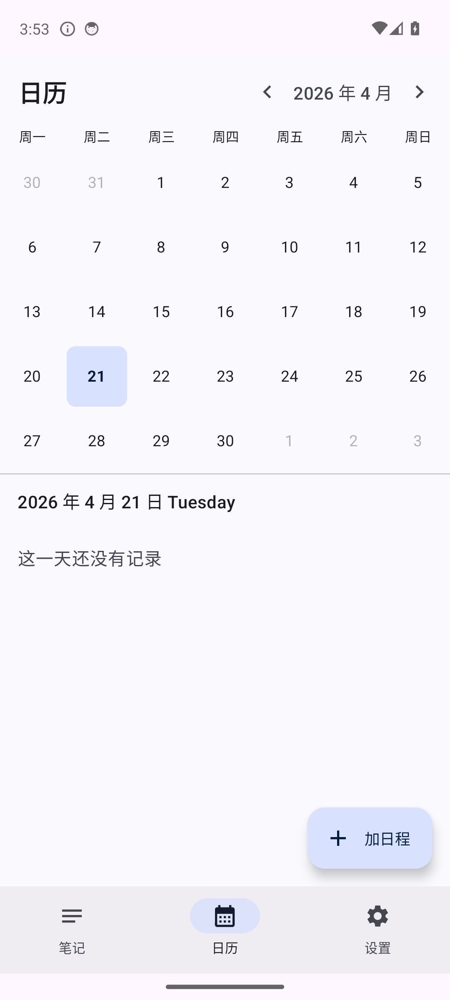
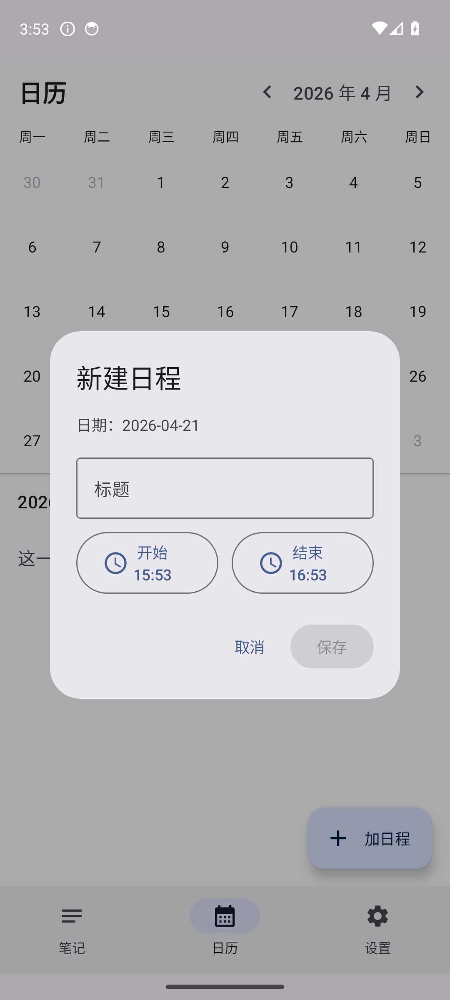
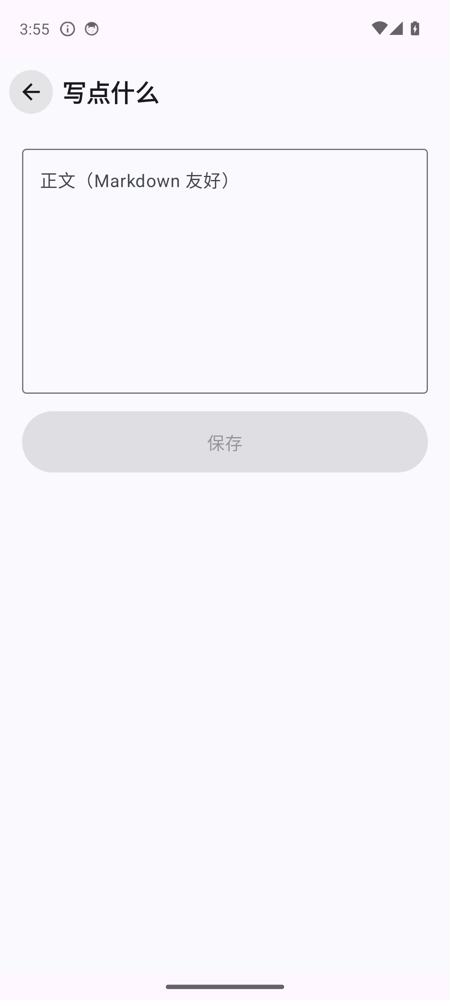
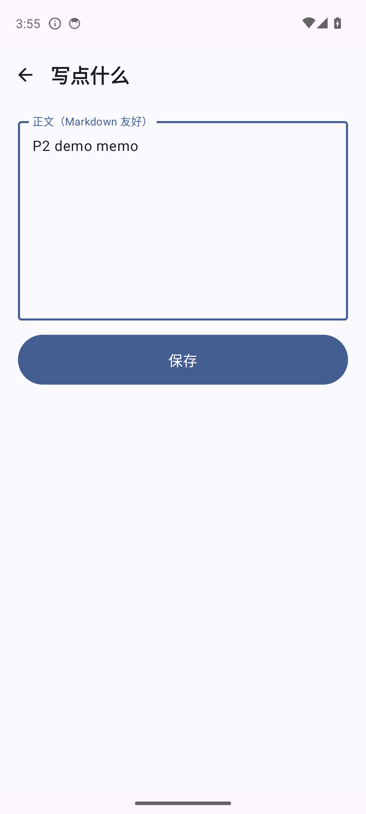

# Memo Widget

> 📌 **本仓库文档全部中文**。如果你看到英文内容，说明打开的不是本 README — 请先确认文件名。
>
> - 🟢 **普通用户** → 看 [USER_GUIDE.md《使用说明书》](USER_GUIDE.md)（不需要懂代码）
> - 🛠️ **开发者 / 接手代码** → 看 [HANDOFF.md](HANDOFF.md)（当前架构 + 待办）
> - 📜 **P0 历史设计** → [AGENT_SPEC.md](AGENT_SPEC.md)（已过期，仅存档用途）
> - 📄 **本文**（README.md） → 技术总览，继续往下读

一个后端是 **GitHub** 的 Android 笔记 + 日程 app。写的每一条笔记、每一个日程都会自动 commit 到你自己的 GitHub 仓库，多设备之间自动同步，离线也能用。**v0.11.0-p7 起**接入 AI 问答（任何 OpenAI-compatible endpoint：OpenAI / DeepSeek / ollama 等）；**v0.12.1-p8 起** Memo 小组件重做为"最近 20 条可滚动列表 + 自动刷新 + 手动刷新按钮"，笔记任何增删改都会立即反映到桌面；**v0.12.2-p8 → v0.12.17-p8 P8.1 closeout + P9-revisit 浪潮**收掉了原 punch list 10 条 + 已弃 P9 的约 50 条真实 fix（详见 CHANGELOG 单条 entry）。

[](https://github.com/qqzlqqzlqqzl/memo-widget/releases/tag/v0.12.17-p8)
[]()
[]()
[]()
[]()
[]()
[]()

---

## 这个 app 能干什么

| 功能 | 说明 |
|---|---|
| 📝 写笔记 | 按天分组的 Markdown 笔记（`## HH:MM`）+ P6.1 起的 Obsidian 风一笔记一文件 |
| 📅 记日程 | 标准 iCalendar (`.ics`) 格式，Google / 苹果日历可以直接订阅 |
| 🔁 循环日程 | `FREQ=WEEKLY` / `FREQ=MONTHLY` RRULE，日历页事件右侧显示 🔁 |
| 🔔 本地提醒 | 事件开始前 5 / 15 / 60 分钟弹系统通知（AlarmManager） |
| 🔍 搜索 | 全文搜索所有笔记 |
| 🏠 桌面小部件 | **P8 重做**：Memo widget 可滚动展示最近 **20 条**笔记（非 3 条快照），顶部带 ➕ 新建 / 🔄 手动刷新；笔记增删改 / 同步 push/pull / 切 PAT 全自动刷新桌面。Today widget 维持"今天"视角（4×2） |
| ☁️ GitHub 同步 | 写完自动推送；每 30 分钟后台 Pull；PushWorker 有 SHA 冲突自愈 |
| 📴 离线可用 | 没网也能写，有网自动 push |
| 🔒 加密 Token | PAT + AI API Key 走 Android Keystore + EncryptedSharedPreferences 加密，FLAG_SECURE 防截屏 |
| 🟦 同步状态条 | 笔记页顶部 `SyncBanner`：成功静默，失败红条 + 错误码，用户可关 |
| 🤖 AI 问答 | **v0.11.0-p7 起**。Settings 填 Provider URL / API Key / Model；顶栏 🧠 图标进聊天，或长按任一笔记选"问 AI"带笔记内容提问。三段上下文切换（无 / 当前笔记 / 全部笔记）+ 多轮对话 |

---

## 界面截图

### 笔记列表

按日期倒序排列所有笔记，顶部有搜索，右下角浮动按钮快速写一条。同步失败时顶部会出现红色条 (`SyncBanner`)。



### 设置页

填 GitHub Personal Access Token / owner / repo / branch，保存后顶部状态条变蓝。PAT 走 `EncryptedSharedPreferences` + Android Keystore，本机也看不到明文；明文可见时自动加 `FLAG_SECURE` 防截屏。

| 空态 | 填好后 | 保存 |
|---|---|---|
|  |  |  |

### 日历 + 日程

月视图支持前后翻月，有笔记/日程的日期下方有蓝色小点。点某一天，下方列出当天所有日程和笔记。循环日程每个发生都会在对应日期显示，但只有一条数据库记录。右下角"加日程"弹出编辑对话框，可选"不重复 / 每周 / 每月 / 自定义"以及"无 / 5 分钟前 / 15 分钟前 / 1 小时前"提醒。

| 月视图 | 新建日程（含循环 + 提醒） |
|---|---|
|  |  |

### 写笔记

简单的 Markdown 编辑器，支持多行，可以写列表、引用、代码块（Markdown 友好）。保存后自动推送到 GitHub。

| 空白 | 打字中 |
|---|---|
|  |  |

### 桌面小部件

长按桌面 → 添加小部件 → 找到 **备忘**（2×2，快速写一条）或 **今日**（4×2，今天的日程 + 备忘一览）。

> Widget 实机截图待补（`adb exec-out screencap` 在 launcher 进程里需要额外权限，下个版本用真机截图补上）。

---

## 怎么装

1. 去 [Releases](https://github.com/qqzlqqzlqqzl/memo-widget/releases) 下载最新的 `app-debug.apk`（当前最新：**v0.6.0-p4.1**）
2. 手机上点这个 apk → 系统会要求你在"设置 → 应用 → 特殊权限 → 安装未知来源"里给浏览器打勾
3. 装好后打开 app → **Android 13+ 会弹通知权限请求，务必允许**（否则事件提醒收不到）
4. 去设置页填三项：
   - **GitHub PAT**：[去这里生成一个](https://github.com/settings/tokens/new?scopes=repo)，选 `repo` 权限
   - **Owner**：你的 GitHub 用户名
   - **Repo**：你想存笔记的仓库名（提前建好，空仓库也行）
5. 回笔记页或日历页开始用

---

## 数据是怎么存的

你的 GitHub 仓库会长这样：

```
<你的仓库>/
├── 2026-04-21.md          # 当天的笔记，## HH:MM 分段
├── 2026-04-22.md
├── 2026-04-23.md
└── events/
    ├── 7f3c-4a2d.ics      # 一个日程一个文件（标准 iCalendar）
    └── 8b21-9c5e.ics
```

**笔记文件** 打开来长这样：

```markdown
# 2026-04-21

## 14:30
今天学了 Glance widget。

## 15:12
- 买菜
- 跑步 30min

## 18:05
晚餐：凉面
```

**日程文件** 打开来是标准 iCalendar（RFC 5545 兼容，含 line folding + UID escape），可以直接被 Google Calendar / 苹果日历订阅：

```
BEGIN:VCALENDAR
VERSION:2.0
PRODID:-//memo-widget//EN
BEGIN:VEVENT
UID:7f3c-4a2d
SUMMARY:团队周会
DTSTART:20260422T070000Z
DTEND:20260422T080000Z
RRULE:FREQ=WEEKLY
END:VEVENT
END:VCALENDAR
```

> 💡 **提醒设置（`reminderMinutesBefore`）是本地设备偏好，不写入 `.ics`**。换设备或新增设备要各自设一次。

---

## 架构一览

```
┌─────────────┐   ┌─────────────────┐   ┌──────────────┐   ┌─────────────────┐
│  主 app UI  │   │  桌面小部件      │   │  WorkManager │   │  AlarmManager    │
│  (3 tabs)   │   │  (Glance x2)    │   │  (后台同步)   │   │  (事件本地提醒)  │
└──────┬──────┘   └────────┬────────┘   └──────┬───────┘   └────────┬────────┘
       └──────────┬────────┴────────────────────┴─────────────────────┘
                  ▼
          ┌─────────────────┐
          │  Repository 层  │  本地优先：先写 Room，再推 GitHub
          │  (Memo/Event)   │  + PathLocker 序列化同文件的并发写
          └────────┬────────┘
                   ▼
           ┌──────────────┐
           │     Room     │  ←── UI 数据唯一来源（schema v6）
           │  schema v6   │      notes + events + indices
           └──────┬───────┘
                  │ 脏行队列
                  ▼
           ┌──────────────┐   HTTPS+PAT    ┌──────────┐
           │  Ktor CIO    │ ─────────────▶ │  GitHub  │
           │  30s timeout │ ◀───────────── │  仓库    │
           └──────────────┘                └──────────┘
```

### 关键点

- **本地优先**：每次写笔记/日程，先写 Room 标记为 `dirty=1`，然后尝试立刻推 GitHub；失败则由 `PushWorker` 定时重试，UI 上显示"待同步"
- **同步状态总线**：`SyncStatusBus`（进程内 StateFlow）发射 `Idle / Syncing / Ok / Error`；笔记页顶部的 `SyncBanner` 消费，失败显示错误码 + 一键关闭
- **并发安全**：`PathLocker` 以 `filePath` 作锁，`appendToday` 和 `PushWorker` 对同一个 note/event 永远串行化
- **CONFLICT 自愈**：PushWorker 遇到 409/422 会自动 `GET` 刷新 SHA 后重试一次（常见场景：另一台设备刚 push 过）
- **Rate-limit 防御**：首次安装 bootstrap 每 cycle 至多 50 次 `GET`（笔记+事件各 50），剩下下轮继续；避免打爆 GitHub API 限额
- **Ktor Timeout**：`requestTimeoutMillis=30s / connectTimeoutMillis=15s / socketTimeoutMillis=30s`，防止挂起的连接永久占着 Worker
- **PAT 加密**：走 `EncryptedSharedPreferences` + Android Keystore 硬件加密；从老版本（P1 之前）明文 DataStore 自动迁移
- **FLAG_SECURE**：设置页 PAT 明文可见时自动加屏蔽标记，截图/多任务窗口看不到
- **事件提醒**：`AlarmScheduler.setExactAndAllowWhileIdle`（精确），系统拒绝精确时降级 `setAndAllowWhileIdle`（~15 分钟窗口）；循环事件响完自动排下一次，AlarmManager 只占 1 个 slot
- **锁屏隐私**：通知 `VISIBILITY_PRIVATE` + public version 仅显示"日程提醒"，解锁后看完整
- **冷启动安全**：`ServiceLocator.init` 幂等，每个 Worker / Receiver 首行都调一次，BootReceiver / AlarmReceiver 再早也不会 NPE

---

## 开发/构建

环境：macOS + Android SDK (compileSdk 35) + JDK 17 + AGP 8.7.3

```bash
# 克隆
git clone https://github.com/qqzlqqzlqqzl/memo-widget.git
cd memo-widget

# 构建
./gradlew :app:assembleDebug
# APK 位于 app/build/outputs/apk/debug/app-debug.apk

# 跑测试（24 项单元测试）
./gradlew :app:testDebugUnitTest

# lint
./gradlew :app:lintDebug

# Release 打包（需要 keystore；当前仅 debug apk 随 release 附）
./gradlew :app:assembleRelease
```

**镜像 / 代理**：`settings.gradle.kts` 已配阿里云 Maven 镜像，`gradle-wrapper.properties` 用腾讯云下 Gradle。

---

## 版本历史

| 版本 | 日期 | 亮点 |
|---|---|---|
| **v0.6.0-p4.1**（最新） | 2026-04-21 | 事件本地提醒（AlarmManager + POST_NOTIFICATIONS + 锁屏隐私） |
| v0.5.0-p4 | 2026-04-21 | RRULE 循环事件（每周 / 每月） + Proguard release 规则 + 11 个 review issue 全关 |
| v0.4.0-p3 | 2026-04-21 | 8 个 review issue 修复 + ICS 往返测试 |
| v0.3.0-p2 | 2026-04-21 | 日历 + 日程 (`.ics`) + 今日清单 widget + 中文 README |
| v0.2.0-p1 | 2026-04-21 | Room 离线缓存 + WorkManager 后台同步 + PAT 加密 + 底部导航 |
| v0.1.0 | 初版 | 2×2 Memo widget + GitHub PUT 推送 |

---

## 技术栈

Kotlin 2.0 · Jetpack Compose + Material 3 · Jetpack Glance 1.1 (widget) · **Room 2.6 schema v6** (本地库) · WorkManager 2.9 (后台同步) · **AlarmManager** (本地提醒) · Ktor CIO 2.3 + HttpTimeout (HTTP) · **EncryptedSharedPreferences** (PAT) · Navigation Compose 2.8 · [Kizitonwose Calendar](https://github.com/kizitonwose/Calendar) 2.6 (日历) · 自研精简 iCalendar (RFC 5545) 编解码器含 line folding + 字段 escape

Room schema 迁移链：`v1 → v2` 加 events 表 · `v2 → v3` events.filePath 唯一索引 · `v3 → v4` events.rrule · `v4 → v5` events.reminderMinutesBefore · `v5 → v6` note_files.date 索引

---

## 权限一览（AndroidManifest）

| 权限 | 用途 | 时机 |
|---|---|---|
| `INTERNET` | Ktor 走 HTTPS 访问 GitHub API | 始终 |
| `POST_NOTIFICATIONS` | 发事件提醒 | Android 13+ 运行时请求（MainActivity.onCreate） |
| `RECEIVE_BOOT_COMPLETED` | 开机后重排所有未来提醒 | 系统授权 |
| `SCHEDULE_EXACT_ALARM` / `USE_EXACT_ALARM` | 精确到分钟的事件提醒 | 系统通常自动授权，否则降级不精确 |

---

## 已知限制 / 仍开放的 issue

截至 v0.6.0-p4.1，GitHub 仍有 **13 个 open issue**，大部分是 P4.1 自审发现但未触及主路径的改进项：

- **#19 / #29 / #25** — 性能 & 防御性（bootstrap rate-limit 细化、笔记索引优化、listDir 错误穿透）
- **#20** — Ktor HttpTimeout 已加（工作树未提交，下一个 session 的第一件事）
- **#22 / #23** — EventEditDialog `rememberSaveable(null)` 会跨 session 残留状态；未知 RRULE 无选中状态
- **#21** — SyncStatusBus 在 Worker 被系统杀掉时卡 Syncing
- **#24** — POST_NOTIFICATIONS 永久拒绝后没有引导去系统设置
- **#26 / #27** — GitHub 403 rate-limit 与 auth 403 无法区分；CONFLICT 已加 SHA 刷新（未提交）
- **#28** — ICS line folding / RRULE escape（部分已加到未提交工作树）
- **#30** — AppNav Notes tab 切换丢 ViewModel 状态
- **#31** — CalendarViewModel 每次选日都重算 RRULE 展开（已修，未提交）

> 🛠️ **工作树里已经有针对 #19/#20/#21/#22/#23/#27/#28/#29/#31 的修复代码** — 没 commit。详情见 [HANDOFF.md](HANDOFF.md)。

### 下一阶段候选（P5）

- 多设备同时改同一个 `YYYY-MM-DD.md` 的 CRDT 式合并
- release 签名 APK + Play Store 适配
- iCalendar VALARM 子块支持（把提醒写进 `.ics`，跨设备同步提醒）
- RRULE UNTIL / COUNT / EXDATE（"重复到某天 / 重复 N 次 / 排除某天"）
- 笔记多设备编辑的冲突解决 UI
- 历史笔记懒加载（当前只拉最近 14 天，bootstrap 时才全量）
