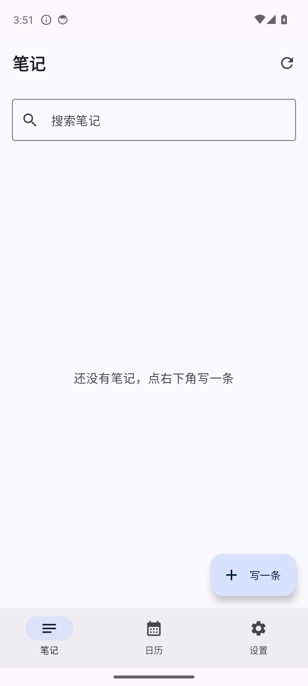
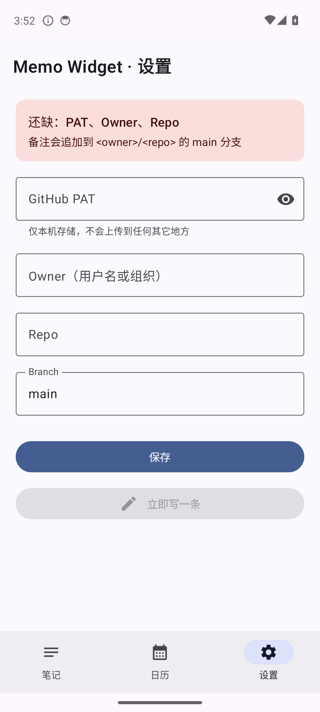
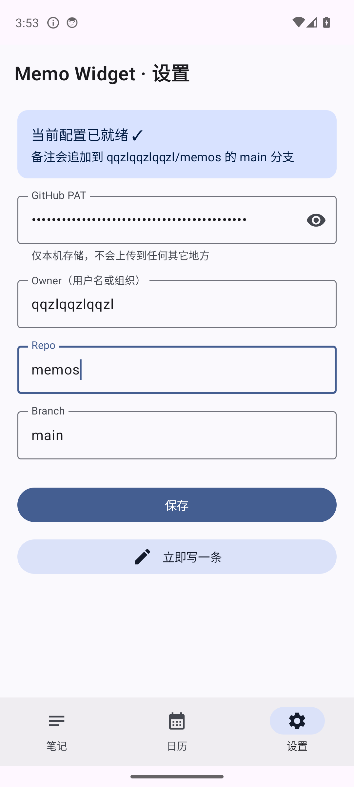
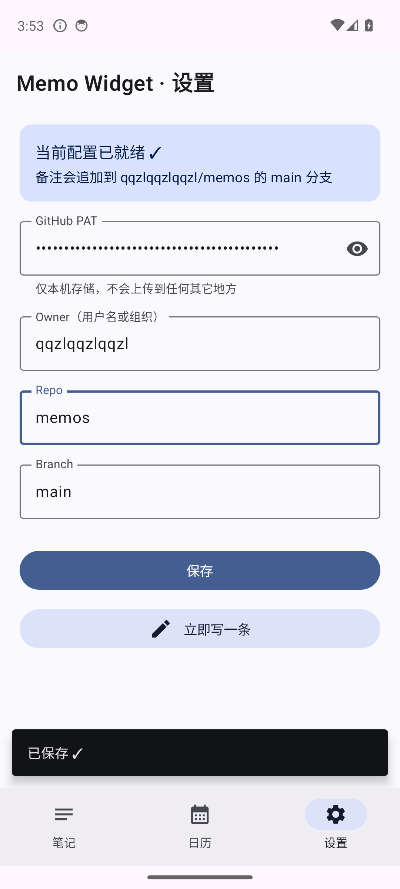
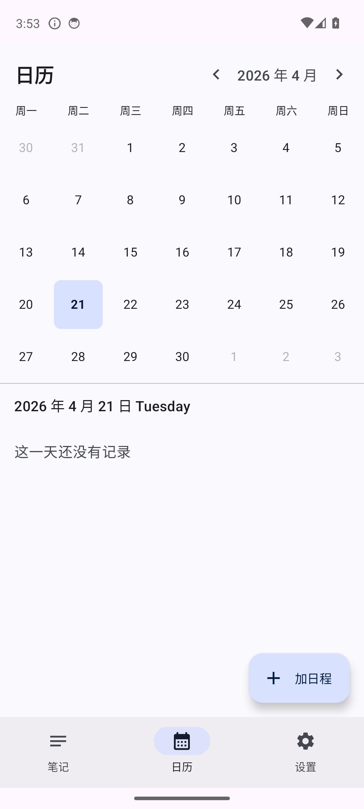
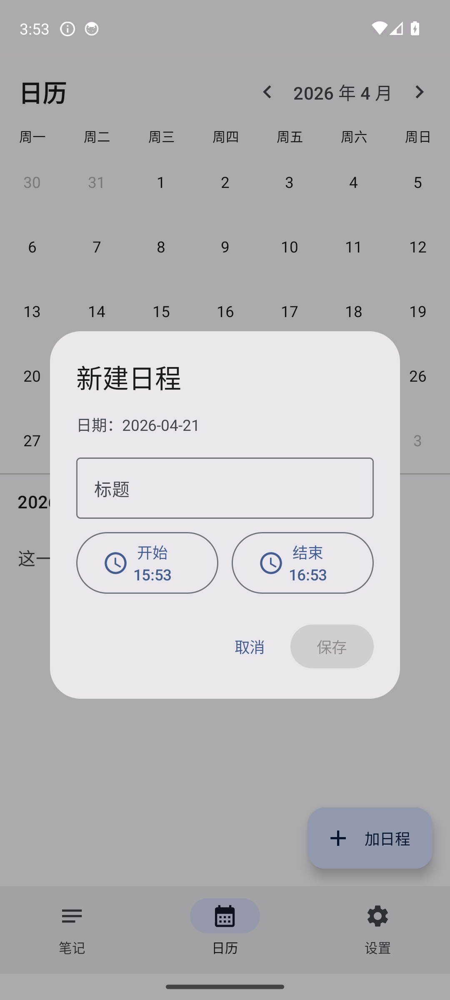
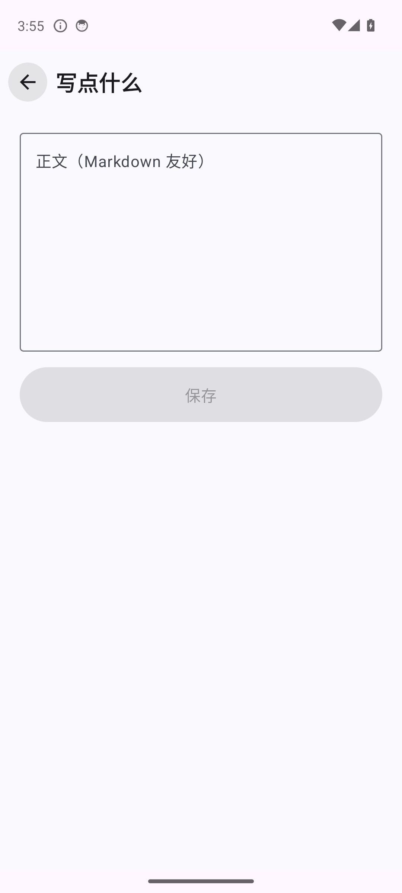
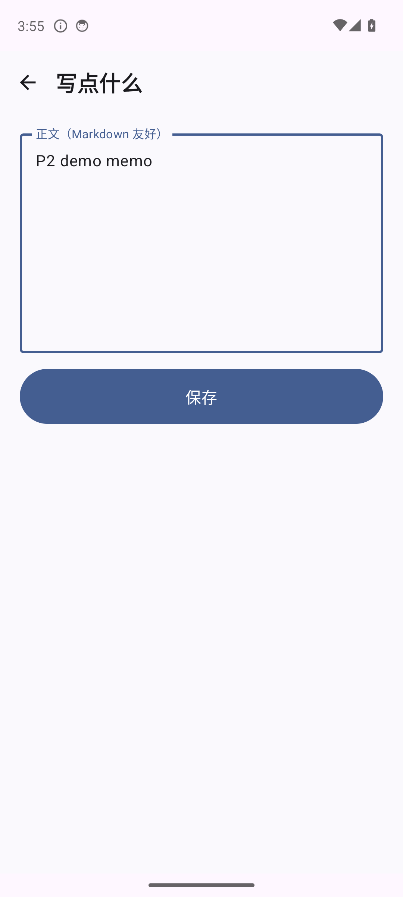

# Memo Widget

Memo Widget is an MIT-licensed Android app for Git-backed personal notes, calendar data, home-screen widgets, offline sync, and optional OpenAI-compatible Q&A.

Every note and event is stored in a GitHub repository chosen by the user. Notes are written as Markdown, calendar events are stored as iCalendar files, and local edits are synced through GitHub while remaining usable offline.

The project is early-stage, but it has real open source maintenance surface area: Android release hardening, sync conflict handling, encrypted GitHub PAT/API-key storage, CI, Dependabot, issue triage, changelog discipline, security reporting guidance, and user-facing documentation.

[](https://github.com/qqzlqqzlqqzl/memo-widget/releases/tag/v0.12.19-p8)
[](https://github.com/qqzlqqzlqqzl/memo-widget/actions/workflows/ci.yml)
[]()
[](MAINTENANCE.md)
[](LICENSE)
[]()
[]()
[]()
[]()

---

## Current Status

Last maintenance review: **2026-06-01**.

The repository has a public MIT license, CI, Dependabot, security reporting guidance, contribution docs, issue templates, PR templates, release notes, screenshots, and an explicit [maintenance status](MAINTENANCE.md). The next work is focused on release signing, sync conflict handling, iCalendar reminder support, and real-device widget screenshot refresh.

---

## Documentation

- [User guide](USER_GUIDE.md): end-user setup and usage notes.
- [Maintainer handoff](HANDOFF.md): architecture, current state, and maintenance notes.
- [Changelog](CHANGELOG.md): release history and regression context.
- [Maintenance status](MAINTENANCE.md): current focus, maintainer responsibilities, and next release candidates.
- [Security policy](SECURITY.md): private vulnerability reporting and security design notes.
- [Contributing guide](CONTRIBUTING.md): development setup and pull request expectations.

## What It Does

| Feature | Description |
|---|---|
| Notes | Daily Markdown notes grouped by timestamp, plus single-note-file storage for Obsidian-style workflows. |
| Calendar | Events are stored as standard `.ics` files and can be consumed by external calendar tools. |
| Recurring events | Supports weekly and monthly RRULE recurrence. |
| Local reminders | Android notifications before events using `AlarmManager`. |
| Search | Full-text search across local notes. |
| Home-screen widgets | Scrollable memo widget, quick-create action, manual refresh, and a Today widget. |
| GitHub sync | Local-first writes, periodic pull, push retry, and SHA conflict recovery. |
| Offline support | Notes and events can be created without network access and synced later. |
| Secret storage | GitHub PATs and AI API keys are encrypted with Android Keystore-backed storage. |
| AI Q&A | Optional OpenAI-compatible chat over the current note or all notes. |

---

## Screenshots

### Notes

Notes are listed by date with search and a quick-create action. Sync failures appear in a dismissible banner.



### Settings

Users configure a GitHub Personal Access Token, repository owner, repository name, and branch. PATs are stored through `EncryptedSharedPreferences` and Android Keystore; secret-revealing screens use `FLAG_SECURE` where appropriate.

| Empty | Filled | Saved |
|---|---|---|
|  |  |  |

### Calendar

The calendar shows notes and events by date. Recurring events are expanded in the UI while keeping a single event record.

| Month view | New event with recurrence and reminders |
|---|---|
|  |  |

### Editor

The editor supports multi-line Markdown. Saved notes are written locally first and then synced to GitHub.

| Empty | Editing |
|---|---|
|  |  |

### Widgets

The app provides a memo widget for quick notes and a Today widget for the current day's events and notes.

> Real-device widget screenshots are still pending because launcher screenshots need extra device permissions.

---

## Installation

1. Download the latest public APK from [Releases](https://github.com/qqzlqqzlqqzl/memo-widget/releases). Current latest public release: **v0.12.19-p8**.
2. Install the APK on Android. You may need to allow installation from unknown sources for the browser or file manager you use.
3. On Android 13+, grant notification permission so event reminders can fire.
4. Open Settings and configure:
   - **GitHub PAT**: create one from [GitHub token settings](https://github.com/settings/tokens/new?scopes=repo) with `repo` scope.
   - **Owner**: your GitHub username or organization.
   - **Repo**: the repository where notes and events should be stored.
5. Start writing notes or creating calendar events.

---

## Data Model

The user's GitHub repository stores plain Markdown notes and iCalendar files:

```
<your-repo>/
├── 2026-04-21.md          # Daily notes grouped by ## HH:MM
├── 2026-04-22.md
├── 2026-04-23.md
└── events/
    ├── 7f3c-4a2d.ics      # One standard iCalendar file per event
    └── 8b21-9c5e.ics
```

Example note file:

```markdown
# 2026-04-21

## 14:30
Learned about Glance widgets.

## 15:12
- Buy groceries
- Run for 30 minutes

## 18:05
Dinner notes
```

Example iCalendar event:

```
BEGIN:VCALENDAR
VERSION:2.0
PRODID:-//memo-widget//EN
BEGIN:VEVENT
UID:7f3c-4a2d
SUMMARY:Weekly team meeting
DTSTART:20260422T070000Z
DTEND:20260422T080000Z
RRULE:FREQ=WEEKLY
END:VEVENT
END:VCALENDAR
```

Reminder settings are local device preferences and are not written into `.ics` files.

---

## Architecture

```
┌─────────────┐   ┌─────────────────┐   ┌──────────────┐   ┌─────────────────┐
│ Main app UI │   │ Home widgets    │   │  WorkManager │   │  AlarmManager    │
│  (4 tabs:   │   │  (Glance x2)    │   │ background   │   │ local event     │
│ notes/tags/ │   │                 │   │              │   │                  │
│ calendar/   │   │                 │   │              │   │                  │
│ settings)   │   │                 │   │              │   │                  │
└──────┬──────┘   └────────┬────────┘   └──────┬───────┘   └────────┬────────┘
       └──────────┬────────┴────────────────────┴─────────────────────┘
                  ▼
          ┌─────────────────┐
          │ Repository      │  Local first: write Room, then push GitHub
          │  (Memo/Event)   │  + PathLocker serializes same-path writes
          └────────┬────────┘
                   ▼
           ┌──────────────┐
           │     Room     │  ←── Single source of truth for UI
           │  schema v9   │      notes + events + single_notes + indices
           └──────┬───────┘
                  │ dirty queue
                  ▼
           ┌──────────────┐   HTTPS+PAT    ┌──────────┐
           │  Ktor CIO    │ ─────────────▶ │  GitHub  │
           │  30s timeout │ ◀───────────── │  repo    │
           └──────────────┘                └──────────┘
```

### Key Design Points

- **Local-first writes**: notes and events are written to Room first, marked dirty, then pushed to GitHub.
- **Retryable sync**: `PushWorker` retries failed pushes and refreshes SHA after common conflict responses.
- **Path-level locking**: `PathLocker` serializes writes to the same note/event path.
- **Rate-limit defense**: initial bootstrap limits GitHub API reads per cycle.
- **HTTP timeouts**: Ktor requests use bounded request, connect, and socket timeouts.
- **Secret storage**: GitHub PATs and AI API keys use Android Keystore-backed encrypted preferences.
- **Screenshot protection**: secret-revealing screens use `FLAG_SECURE`.
- **Reminder scheduling**: event reminders use `AlarmManager` with exact scheduling fallback.
- **Cold-start safety**: workers and receivers initialize app services idempotently.

---

## Development

Requirements: Android SDK with compileSdk 35, JDK 17, and Android Gradle Plugin 8.7.3.

```bash
git clone https://github.com/qqzlqqzlqqzl/memo-widget.git
cd memo-widget

./gradlew :app:assembleDebug
./gradlew :app:testDebugUnitTest
./gradlew :app:lintDebug
./gradlew :app:assembleRelease
```

Debug APK output: `app/build/outputs/apk/debug/app-debug.apk`.

---

## Release History

| Version | Date | Highlights |
|---|---|---|
| **v0.12.19-p8** (latest public release) | 2026-04-29 | R8 widget class keep rules + installable release/debug APK |
| v0.12.18-p8 | 2026-04-29 | Signed APK fix |
| v0.12.17-p8 | 2026-04-28 | Lint cleanup wave 3 |
| v0.12.1-p8 | 2026-04-23 | Scrollable memo widget + automatic refresh |
| v0.11.0-p7 | 2026-04-23 | OpenAI-compatible AI Q&A |
| v0.6.0-p4.1 | 2026-04-21 | Local event reminders and lock-screen privacy |
| v0.3.0-p2 | 2026-04-21 | Calendar, `.ics` events, and Today widget |
| v0.2.0-p1 | 2026-04-21 | Room offline cache, WorkManager sync, encrypted PAT storage |
| v0.1.0 | Initial | 2x2 memo widget + GitHub PUT sync |

---

## Tech Stack

Kotlin 2.0 · Jetpack Compose + Material 3 · Jetpack Glance · Room schema v9 · WorkManager · AlarmManager · Ktor CIO · EncryptedSharedPreferences · Navigation Compose · [Kizitonwose Calendar](https://github.com/kizitonwose/Calendar) · lightweight iCalendar encoder/decoder · Android network security config.

Room migration chain: `v1 -> v2` events table · `v2 -> v3` unique `events.filePath` index · `v3 -> v4` event RRULE · `v4 -> v5` reminder minutes · `v5 -> v6` `note_files.date` index.

---

## License

Memo Widget is released under the MIT License. See [LICENSE](LICENSE).

---

## Android Permissions

| Permission | Purpose | Timing |
|---|---|---|
| `INTERNET` | Access GitHub over HTTPS through Ktor. | Always required. |
| `POST_NOTIFICATIONS` | Show event reminder notifications. | Runtime request on Android 13+. |
| `RECEIVE_BOOT_COMPLETED` | Reschedule future reminders after reboot. | Granted by the system. |
| `SCHEDULE_EXACT_ALARM` / `USE_EXACT_ALARM` | Schedule minute-level event reminders. | Uses exact alarms when allowed, with fallback scheduling otherwise. |

---

## Roadmap

- Multi-device conflict resolution for simultaneous edits to the same note file.
- Proper release signing and Play Store packaging.
- iCalendar `VALARM` support so reminders can sync across devices.
- More complete RRULE support, including `UNTIL`, `COUNT`, and `EXDATE`.
- Conflict resolution UI for multi-device note edits.
- Lazy loading for older notes.
