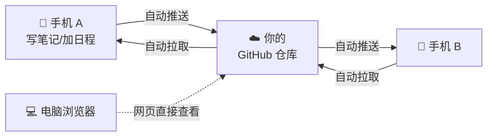
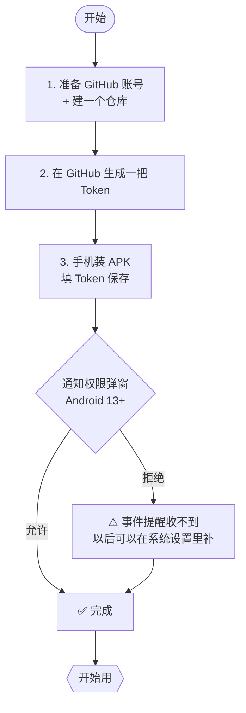
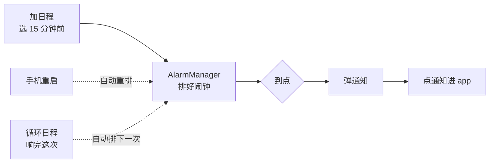
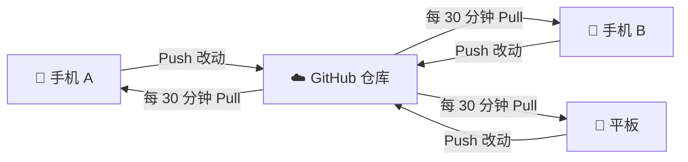
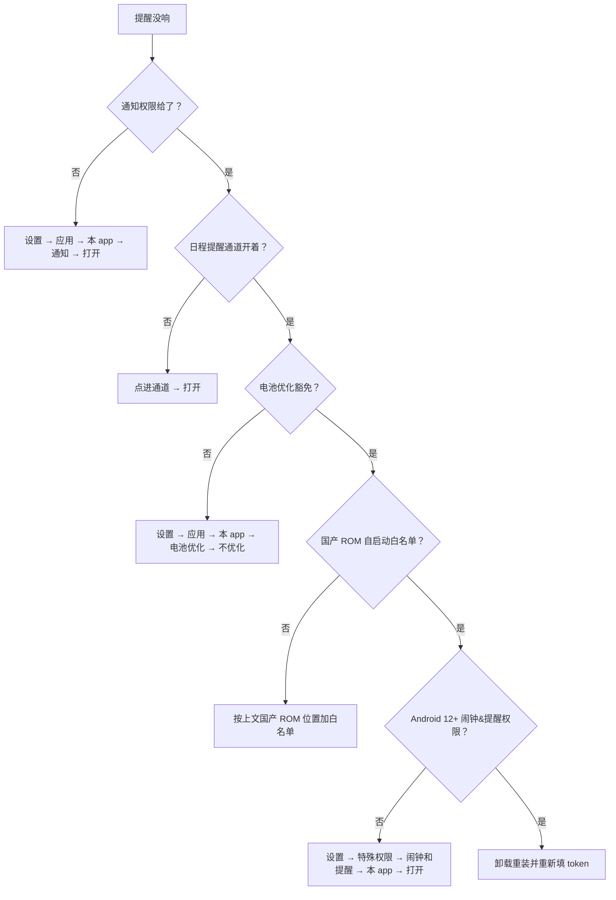

# 📖 使用说明书

> 本文面向 **普通用户** —— 不用懂代码也能看懂。
> 开发者请看 [README.md](README.md)。

---

## 🎯 这是什么？一句话解释

**一个 Android 备忘 + 日程 app，所有内容存在你自己的 GitHub 仓库里。**



**为什么是这样？**

| 问题 | 传统云笔记 | 本 app |
|---|---|---|
| 数据在哪？ | 服务商云端 | **你自己的 GitHub 仓库** |
| 断网能用？ | ❌ 经常不能 | ✅ 完全能，联网自动传 |
| 换手机要导出？ | 😓 要 | ❌ 不用，装上填 token 就回来 |
| 服务商看我数据？ | 👀 理论可看 | 🔒 本 app 作者看不到 |
| 网页直接看到我的笔记？ | 🚫 要登录 | ✅ 打开 GitHub 仓库就看 |

---

## 📑 目录

1. [🎬 首次使用 3 步](#-首次使用-3-步)
2. [📝 日常怎么用](#-日常怎么用)
3. [🏠 桌面小部件](#-桌面小部件)
4. [🔔 事件提醒](#-事件提醒)
5. [🔁 多设备同步](#-多设备同步)
6. [🤖 AI 问答](#-ai-问答)
7. [❓ 常见问题](#-常见问题)
8. [📂 你的数据长什么样](#-你的数据长什么样)
9. [🆘 还是不行？](#-还是不行)

---

## 🎬 首次使用 3 步



### 第 1 步：准备 GitHub 账号和一个仓库

1. 如果还没 GitHub 账号，去 [github.com](https://github.com) 注册
2. 新建一个仓库：
   - **推荐设为 Private** 🔒（私有，别人搜不到、看不到）
   - 命名随意，推荐 `memos` 或 `notes`
   - 空仓库就行，不要初始化 README/LICENSE/gitignore

---

### 第 2 步：生成一把 Token（PAT）

点这个链接一步到位 👉 [生成 PAT（预选 repo 权限）](https://github.com/settings/tokens/new?scopes=repo&description=memo-widget)

#### 🎯 需要勾哪些权限？

> **只勾最上面那一组大勾 `repo`**，其它一个别勾。

| 权限 | 勾不勾？ | 干嘛的 |
|---|:---:|---|
| **`repo`**（一整组） | ✅ **勾** | 读写你自己的仓库（这就是本 app 需要的） |
| `workflow` | ❌ 不勾 | 改 GitHub Actions 文件（本 app 不碰） |
| `write:packages` | ❌ 不勾 | 发布 npm/maven 包（无关） |
| `admin:*` | ❌ 不勾 | 账号级别管理权限（绝不要给） |
| `delete_repo` | ❌ 不勾 | 删仓库权限（绝不要给） |
| 其它所有 | ❌ 不勾 | 无关 |

#### 🔑 操作流程

1. **Note**（描述）：填 `memo-widget` 或任意名字
2. **Expiration**（过期时间）：
   - 短期测试：30 天
   - **长期自用：建议 90 天或 No expiration（永不过期）**
3. **Select scopes**：**勾上 `repo` 这一整组**
4. 页面拉到最底 → 点绿色 **Generate token** 按钮
5. 💥 **重要**：页面顶部会出现一个 `ghp_XXXXXXXX...` 字符串，**立刻复制**
   - 关掉页面就再也看不到了
   - 如果忘了复制 → 没救，只能重新生成

> ⚠️ **这个 token 等于仓库密码**。只存你自己手机上（本 app 用 Android Keystore 硬件加密存），其它地方不要发、不要写、不要截图发群。

---

### 第 3 步：装 APK 并填配置

#### 📥 下载

1. 去 [Releases 页](https://github.com/qqzlqqzlqqzl/memo-widget/releases)
2. 下最新 **v0.6.0-p4.1** 的 `app-debug.apk`

#### 📱 安装

手机系统设置 → 应用 → 特殊权限 → 安装未知应用 → 给**你用的浏览器**打勾 → 回到下载的 APK 点安装。

> ⚠️ 首次打开 app（Android 13 / API 33 及以上）会弹通知权限请求 —— **一定要点"允许"**，否则日程提醒响不起来。

#### ⚙️ 填配置

打开 app → 点底部 **设置** tab → 填 4 项 → **保存**：


| 字段 | 填什么 | 举例 |
|---|---|---|
| **GitHub PAT** | 粘刚才复制的 `ghp_...` | `ghp_abc123...` |
| **Owner** | 你的 GitHub 用户名 | `qqzlqqzlqqzl` |
| **Repo** | 上一步建的仓库名 | `memos` |
| **Branch** | 默认 `main`（不用改） | `main` |

填好后长这样：


点蓝色 **保存** 按钮 → 顶部状态条变蓝：


> ✅ **看到蓝条 = 装好了**。去笔记页或日历页开始用。

---

## 📝 日常怎么用

### 📝 写一条备忘

#### 方法 A：从桌面小部件（快）

桌面点 2×2 **备忘** widget 的 **+** → 打字 → **保存** → 自动回桌面。

#### 方法 B：从 app 里

1. 打开 app → 底部 **笔记** tab
2. 右下角浮动按钮 **+ 写一条**
3. 打字：

   

4. 边打字边写（Markdown 友好：列表、引用、代码块都认）：

   

5. 顶部 **保存** → 回笔记列表

> 💾 保存瞬间做的事：
>
> 1. 先写本地数据库（哪怕没网，不丢）
> 2. 再尝试推到 GitHub（一般 <1 秒）
> 3. 失败了不报错，下次联网自动补

---

### 🔍 看 / 搜过去写的

笔记列表按**日期倒序**，每天一组，每条带 `HH:MM` 时间戳：


顶部搜索框 → **全文搜索所有天**。

> 💡 默认只拉最近 **14 天**的增量；装新手机或清数据时 app 自动 bootstrap 全部历史（根据仓库大小 10 秒 ~ 1 分钟）。

---

### 📅 加日程

1. 底部 **日历** tab
2. 点某一天（默认今天）
3. 右下角 **+ 加日程**
4. 对话框：

   

5. 填：

| 字段 | 选项 |
|---|---|
| **标题** | 任意文字（例：`团队周会`） |
| **开始时间** | 点进去弹时间选择器 |
| **结束时间** | 同上 |
| **重复** | 🔘 不重复 / 每周 / 每月 / 自定义 |
| **提醒** | 🔘 无 / 5 分钟前 / 15 分钟前 / 1 小时前 |

6. **保存** → 自动推 GitHub、同时排好本地 AlarmManager 提醒

> 🔁 **循环日程**：日历页会在每一次发生的日期都显示这条日程（每周/每月自动推算），但数据库里只有 **1 条记录** —— 改它或删它会一次性改掉所有将来发生。

---

### ✏️ 改 / 🗑️ 删日程

1. 日历 → 点那一天
2. 点列表里的某条日程
3. 同一个对话框弹出 → 改完 **保存**
4. 或左下角 **🗑️ 删除** 按钮

> 💣 **删除是永久的**。本地标记 tombstone，同步时 GitHub 也删；其它设备拉到会一起删。

---

## 📋 桌面小组件

> **v0.12.0-p8 起全面重做**：Memo 小组件从"今天快照 3 条"变成"可滚动的最近 20 条 + 自动刷新"。笔记增删改、同步、切换配置都会让桌面立刻跟着动。

长按桌面空白处 → 添加小部件 → 找到 **Memo** → 选择下面两种之一：

### 📝 Memo 小组件（最近 20 条）

**用法**：长按桌面 → 添加小部件 → **Memo** → 选 **Memo widget**

**形态**：
- **可滚动列表**，默认 **3×3 cell**，用户可以 **resize 到 4×4** 看更多笔记
- 列表最多显示最近 **20 条**笔记（不只是今天、也不只是 3 条）
- 每行展示 `MM/DD HH:mm` 前缀 + 笔记标题（置顶笔记前面有 📌 图标）

**顶部操作**：
- ➕ **新建笔记** — 点一下直接拉起 app 的 Editor 写新笔记（和 2×2 旧版 Memo widget 同入口）
- 🔄 **手动刷新** — 立即从数据库重新拉 20 条最新的（一般不用点，widget 会自动刷新；列出来是为了万一断网 / 系统杀后台导致没跟上时兜底）

**点击行为**：
- **点某条笔记** → 打开该笔记的 Editor 可以直接改
- **未配置 GitHub PAT 时** → 列表变成"先打开 app 配置 GitHub PAT"的提示，点任意位置都跳到主 app 的设置页

### 📅 Today 小组件（今天视角）

**用法**：同上，选 **Today widget**

**形态**：
- **4×2 cell**，不可 resize
- 展示今天的 **events（日程）** + 今天的 **memos（备忘）**
- 语义永远是"今天"：跨日后（过了 0 点）次日打开 widget 会自动换成新的一天的内容

**顶部操作**：同样有 🔄 手动刷新按钮。

### ⚡ 自动刷新

**什么时候 widget 会自动更新**（不用你动手）：

1. 你在 app 里**保存新笔记**后（widget 立即多出一行）
2. 你**删除 / 编辑 / 置顶**笔记后
3. **后台同步任务 Pull 拉到新笔记**后（比如另一台设备刚推过的内容）
4. **后台同步任务 Push 成功**后（本地 dirty 清了，widget 反映同步 OK）
5. 你在设置页**切换 GitHub PAT 配置**后（比如从"未配置"变"已配置"，widget 立刻从提示页变列表）

**多久更新一次**：**立即**（系统底层做了约 250ms 的 debounce 防止连续快速写入时闪烁）。

**手动刷新**：点 widget 顶部的 🔄 按钮。

### ⚠️ 注意事项

- Memo 小组件**最多显示 20 条**，要看更多请打开 app 里的笔记列表页
- Widget **不支持 inline 编辑**（得点进 app 才能改；未来版本可能会加）
- Widget **颜色跟随系统主题**（浅色 / 深色自动切换）
- Widget 渲染依赖 Jetpack Glance，极少数老机型会有几秒延迟；真的没刷新可以点 🔄 强制触发

---

## 🔔 事件提醒



### 🔐 准备工作（首次必做）

| 步骤 | 要干嘛 | 为什么 |
|---|---|---|
| 1️⃣ | 首次开 app 弹**通知权限** → **允许** | 不然提醒通知发不出 |
| 2️⃣ | 系统设置 → 通知 → 本 app → **"日程提醒"通道打开** | 单独这个通道可被系统关 |
| 3️⃣ | 系统设置 → 应用 → 本 app → 电池优化 → **不优化** | 不然后台被杀，闹钟不响 |
| 4️⃣ | **国产 ROM** → 自启动管理 → 把本 app 加白名单 | 🔴 **最重要**，不加重启后全部失效 |

### 📱 国产 ROM 自启动白名单位置

| 品牌 | 路径 |
|---|---|
| 🇨🇳 小米 / Redmi | 设置 → 应用设置 → 授权管理 → 自启动管理 → 找到本 app → 打开 |
| 🇨🇳 华为 / 荣耀 | 设置 → 应用 → 启动管理 → 本 app → 手动管理（全开） |
| 🇨🇳 OPPO / realme | 设置 → 电池 → 应用耗电管理 → 本 app → 允许后台运行 + 允许自启动 |
| 🇨🇳 vivo | 设置 → 电池 → 后台耗电管理 → 本 app → 允许后台高耗电 |
| 🌏 原生 Android | 一般不需要（但电池优化记得豁免） |

### 🎯 怎么让提醒响

1. 加日程时在"提醒"一栏选好时间（5 / 15 / 60 分钟前）
2. 到点系统弹通知：
   > 🔔 **日程提醒**
   > 解锁后看详情
3. 点通知进 app 看具体事件

### 🔒 锁屏隐私

**锁屏只显示"日程提醒"四个字**，不泄露具体标题（`VISIBILITY_PRIVATE`）。解锁后才显示完整内容。

### 🔁 循环日程的提醒

每周/每月循环的日程：**响完这次，自动排下一次** —— AlarmManager 永远只占 1 个 slot，不用担心几百条未来事件塞爆系统。

---

## 🔁 多设备同步

想在手机 A + 手机 B + 平板多个地方同时用？**完全可以**。



### 🛠️ 怎么配

1. 每台设备都装 **同一个** APK
2. 都在设置里填**同一个 PAT + 同一个 owner/repo/branch**
3. 保存后，app 自动 bootstrap 全量历史（<1 分钟）
4. 以后互相自动同步 ✅

### ⚠️ 注意

| 点 | 说明 |
|---|---|
| 🔔 **提醒是设备本地的** | 设备 A 设"15 分钟前"，设备 B 不会自动有；每台设备单独设 |
| ⚡ **同步延迟 ~30 分钟** | Pull 周期是半小时一次。新装设备会立刻触发 bootstrap |
| 💥 **同时改同一天** | 小概率 409 冲突；app 自动刷新 SHA 重试 1 次，多半能解；仍失败会重新入队下次再试 |
| 📴 **离线可用** | A 没网时写的笔记，联网自动传，不丢 |

---

## 🤖 AI 问答

**v0.11.0-p7 起**，app 内可以接入你自己的 AI key（任何 OpenAI-compatible 服务），让 AI 基于你的笔记回答问题。

### 🔧 1. 配置（一次就够）

进设置页，往下滚到「**AI 配置**」栏，填 3 个字段：

| 字段 | 示例 | 去哪拿 |
|---|---|---|
| **Provider URL** | `https://api.openai.com/v1/chat/completions` | 看你用的服务商文档 |
| **API Key** | `sk-...` | OpenAI 控制台 / DeepSeek 平台 / 你的 ollama 主机 |
| **Model** | `gpt-4o-mini` / `deepseek-chat` / `qwen2.5:7b` 等 | 服务商支持的模型名 |

**支持的服务商**（任何 OpenAI-compatible endpoint 都行）：
- 🌏 **OpenAI** — `https://api.openai.com/v1/chat/completions`
- 🇨🇳 **DeepSeek** — `https://api.deepseek.com/chat/completions`（国内访问快、便宜）
- ☁️ **Azure OpenAI** — 你的 Azure 资源 endpoint
- 🏠 **本地 ollama** — `http://你的电脑 ip:11434/v1/chat/completions`（完全离线）
- 🌐 **OpenRouter** — `https://openrouter.ai/api/v1/chat/completions`（一个 key 调各家模型）

填完点「**保存 AI 配置**」，再点「**测试连接**」会发一条 `ping` 验证 key + model 可用。

> 🔒 **安全**：API Key 加密存在 Android Keystore + EncryptedSharedPreferences，跟 GitHub PAT 一套策略。Key 明文可见时自动启 FLAG_SECURE 防截屏。app 任何 log / 错误消息都不会带 key。

### 💬 2. 怎么用

**两个入口**：
1. **右上角 🧠 图标** — 在笔记列表页顶栏点它，进入 AI 助手页（**不**带任何笔记内容）
2. **长按任一笔记卡片** — 弹出菜单选「问 AI」，带着这条笔记的内容进对话（chip 默认选中"当前笔记"）

**三段上下文切换**（AI 页顶部 FilterChip）：
- **无上下文** — 纯聊天，不发笔记内容
- **当前笔记** — 只有从长按入口进入时可用；发你选的那条
- **全部笔记** — 把仓库里所有笔记 body 一起塞进 system prompt（按预算上限 15k 字符，超了自动丢最后几条）

**使用示例**：

> 👤：(从"2026-04-20 项目会议"笔记长按 → 问 AI)  
> 👤：帮我从这条笔记里提炼 3 个要 action 的事  
> 🤖：根据你的笔记内容，以下是 3 个需要跟进的行动项：  
> 1. ...  
> 2. ...  
> 3. ...

> 👤：(全部笔记模式)  
> 👤：我上周主要在忙什么？  
> 🤖：你上周的笔记里主要涉及 3 个话题：...

**多轮对话**：上一轮内容会自动作为下一轮的上下文，无需重复。

### ⚠️ 3. 注意

- **AI 回答不会自动写回笔记** — 你想保存就自己复制过去（v0.11.0-p7 MVP 限制；后续版本加"AI 改写回笔记"按钮）
- **对话不持久化** — 退出 AI 页或杀进程后，对话历史消失；笔记内容不受影响
- **费用你自己付** — app 不代付 API 调用费；OpenAI/Claude/DeepSeek 按 token 收钱，自己去服务商账单看
- **429 速率限制** — 免费层容易撞上，提示"AI 请求失败（HTTP 429）"时等几分钟再试

---

## ❓ 常见问题

### ❌ 1. 顶部出现红色"同步失败"条


点"知道了"暂时关掉。常见原因：

| 错误码 | 原因 | 怎么修 |
|---|---|---|
| `UNAUTHORIZED` | PAT 过期或权限错 | 重新[生成](https://github.com/settings/tokens/new?scopes=repo) 填回去 |
| `NOT_FOUND` | owner/repo/branch 填错 | 去设置页核对 |
| `NETWORK` | 没网 / VPN 挂了 / GitHub 抽风 | 等会儿，来网自动重试 |
| `CONFLICT` | 两台设备同时推 | app 自动刷新 SHA 重试，一般透明 |
| `UNKNOWN` | 其它 | 设置页按一下"保存"重新配一遍 |

---

### 📡 2. 备忘保存了但 GitHub 上看不到

正常情况 <1 秒就上去。如果：

- **没网** → 本地已存好，日期标题旁有"· 待同步"，来网自动传（状态条会变蓝）
- **超过 1 分钟还没上去** → 看顶部有无红条，按上面 Q1 处理
- **彻底不动** → 重开 app 触发一次手动 refresh（笔记页右上角 🔄 按钮）

---

### 🔕 3. 提醒没响

按这个顺序查 👇



| 顺序 | 检查项 | 位置 |
|---|---|---|
| 1️⃣ | 通知权限 | 设置 → 应用 → 本 app → 通知 → 打开 |
| 2️⃣ | "日程提醒"单独通道 | 同上，点进去看 |
| 3️⃣ | 电池优化豁免 | 设置 → 应用 → 本 app → 电池优化 → 不优化 |
| 4️⃣ | **国产 ROM 自启动白名单** | 🔴 见上文"国产 ROM 自启动白名单位置" |
| 5️⃣ | 闹钟和提醒权限（Android 12+） | 设置 → 特殊权限 → 闹钟和提醒 → 本 app |

---

### 📚 4. 历史笔记只看到最近的

app 默认只同步最近 **14 天**。如果想全量：

- **新装手机或清 app 数据** → 会自动 bootstrap 仓库里**所有**笔记（一次性，<1 分钟）
- **在用的手机**：没有 UI 按钮触发，因为性能考虑；直接去 GitHub 网页看你的 `YYYY-MM-DD.md` 文件即可（你的数据透明）

---

### 📦 5. 换手机怎么迁？

> 没有"从旧手机导出"这种步骤。数据都在 GitHub 上。

1. 新手机装 APK
2. 设置里填**同一个** token + owner + repo + branch
3. 打开笔记/日历 tab，第一次会 bootstrap 全量（10 秒 ~ 1 分钟）
4. 完事 ✅

> 🔔 **提醒要重新设**。提醒是本地偏好，不在 GitHub 上。

---

### 🗑️ 6. 想彻底删除 app

1. **本机数据**：卸载 app → 系统自动清加密 token + Room 数据库
2. **云端数据**：
   - 去 GitHub 把仓库删了（settings → danger zone → delete repository）
   - 或者撤销 token（`Settings → Developer settings → Personal access tokens → 那条 → Delete`），仓库留着也可以

---

### 🔧 7. 把 PAT 填错了 / 要换一把

直接回设置页 → 覆盖掉原来的值 → **保存** → 顶部状态条变蓝即可。旧 token 会被自动从加密存储覆盖。

---

### 🆘 8. app 完全不工作 / 一直 loading

试这个顺序：

1. 关 app 重开
2. 笔记页右上角 🔄 手动刷新
3. 设置页重新 **保存** 一次（刷新配置）
4. 打开手机网络浏览器，访问 https://api.github.com/user （带上你的 PAT：`Authorization: Bearer <你的token>`）看返回，能通就说明 GitHub 能达到
5. 卸载重装（数据在 GitHub 上，不丢）

---

## 📂 你的数据长什么样

打开你的 GitHub 仓库：

```
你的仓库/
│
├── 📄 2026-04-21.md          ← 4 月 21 日的备忘（一整天合一个文件）
├── 📄 2026-04-22.md
├── 📄 2026-04-23.md
│
└── 📂 events/
    ├── 📅 7f3c-4a2d.ics      ← 一个日程一个文件
    └── 📅 8b21-9c5e.ics
```

### 📝 备忘文件 (`YYYY-MM-DD.md`) 打开长这样：

```markdown
# 2026-04-21

## 14:30
今天学了 Glance widget。

## 15:12
- 买菜
- 跑步 30min

## 18:05
晚餐：凉面
```

> 💡 每一条备忘 = `## HH:MM` 标题 + 一段 Markdown body。可以在任何编辑器打开直接改，只要格式对，app 下次 pull 就认。

---

### 📅 日程文件 (`events/<uid>.ics`) 打开长这样：

```
BEGIN:VCALENDAR
VERSION:2.0
PRODID:-//memo-widget//EN
BEGIN:VEVENT
UID:7f3c-4a2d
DTSTAMP:20260421T143000Z
SUMMARY:团队周会
DTSTART:20260422T070000Z
DTEND:20260422T080000Z
RRULE:FREQ=WEEKLY
END:VEVENT
END:VCALENDAR
```

这是标准 **iCalendar (RFC 5545)** 格式，可以：

| 平台 | 怎么订阅 |
|---|---|
| 🍎 苹果日历 | 文件 → 新建日历订阅 → 粘 raw URL |
| 📧 Google 日历 | 其他日历 → 从网址订阅 → 粘 raw URL |
| 📅 Outlook | 添加日历 → 从 Web 订阅 |

> 💡 单个 `.ics` 文件也可以直接点下载到手机，导入日历 app。

---

### 🔑 Token 在本机怎么存？

| 在哪 | 加密方式 |
|---|---|
| 本机 `EncryptedSharedPreferences` | AES-256-GCM，密钥存 **Android Keystore 硬件芯片** |
| 本 app 进程内存 | 只在请求时短暂持有，不写日志 |
| 其它（云端 / 开发者 / 任何地方） | **不存、不传、不见**。`Log.d` / toast / 异常信息里都不会出现 |

> 🔒 **设置页明文查看时**：app 自动加 `FLAG_SECURE`，系统截屏和多任务卡片里 PAT 框显示为黑块。

---

## 🆘 还是不行？

1. 🐛 **报 bug**：[Issues 页](https://github.com/qqzlqqzlqqzl/memo-widget/issues) 开一条，贴：
   - 手机型号 + Android 版本
   - 哪个功能不对
   - 顶部红条的错误码（如有）
   - 复现步骤
2. 💡 **提建议**：同样去 Issues 页
3. 📬 **不想公开？** 给仓库 owner 发 DM

---

## 🎉 就酱

愿你用得开心，数据在手。

> 做这个 app 的初心：**你的笔记 = 你的数据，不给任何公司。**
